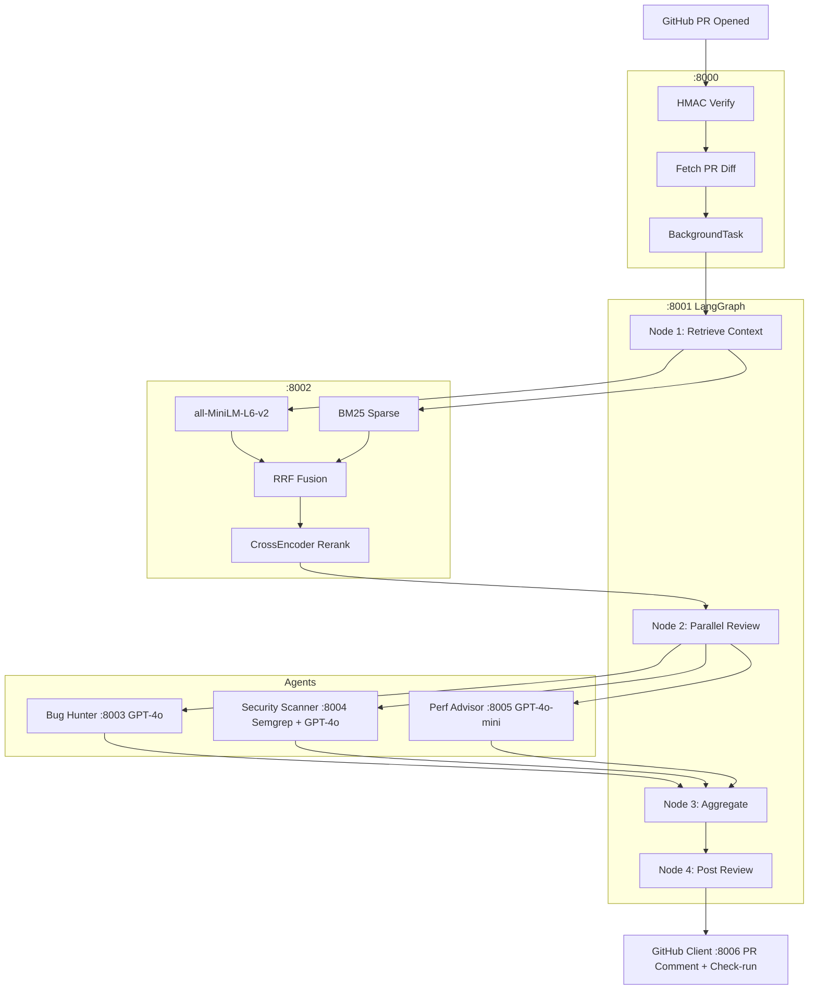
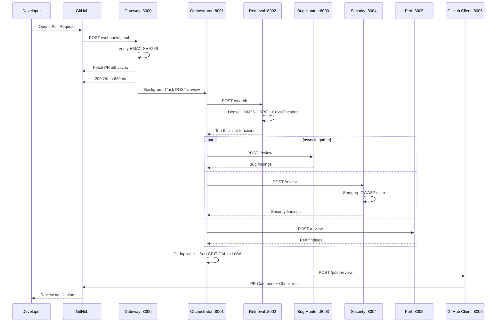
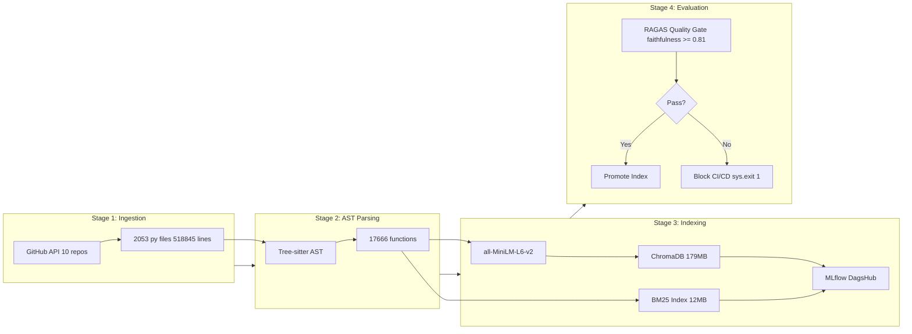
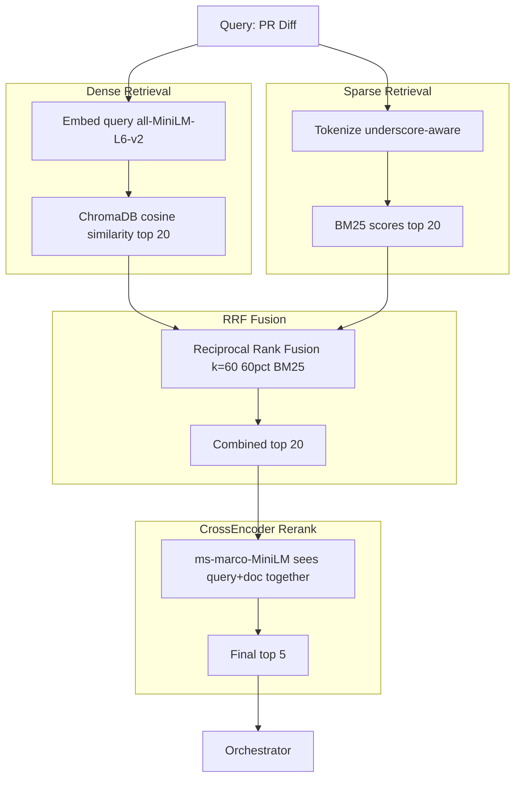
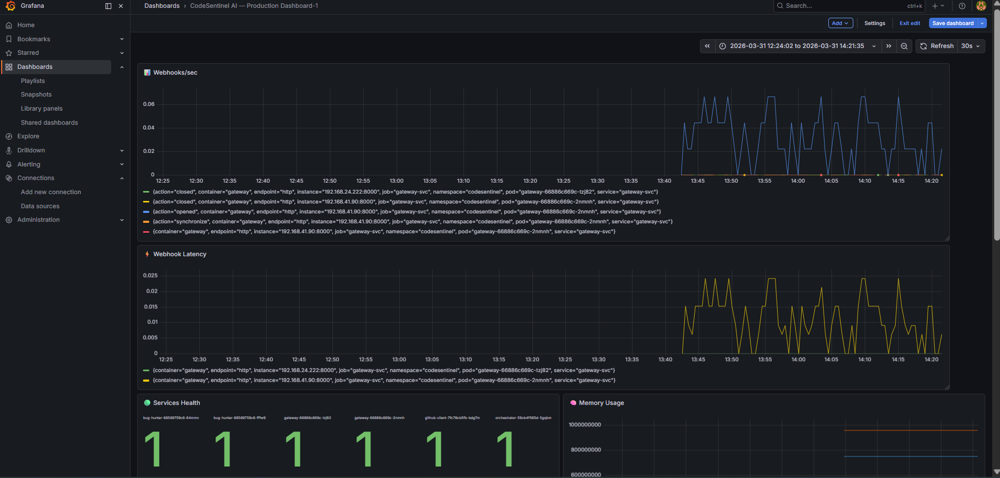
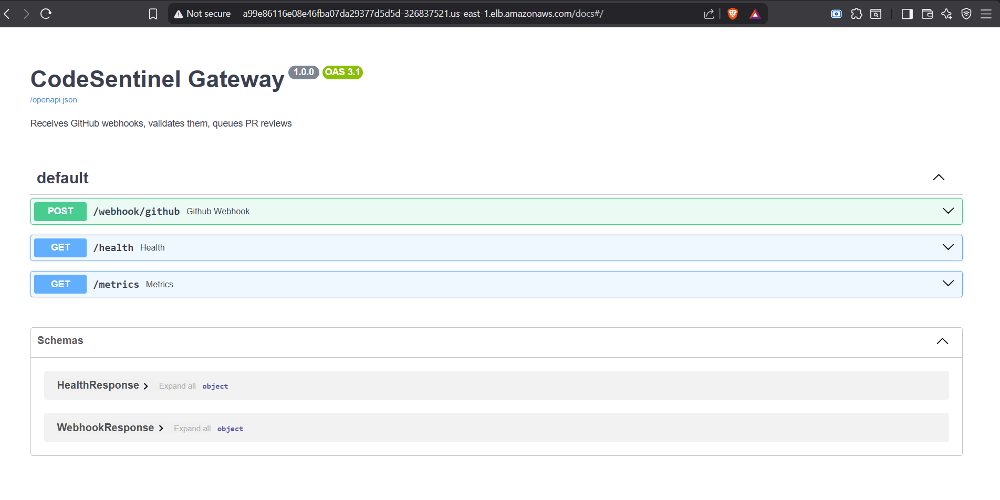
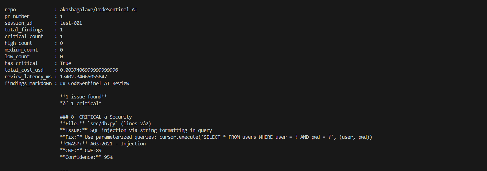
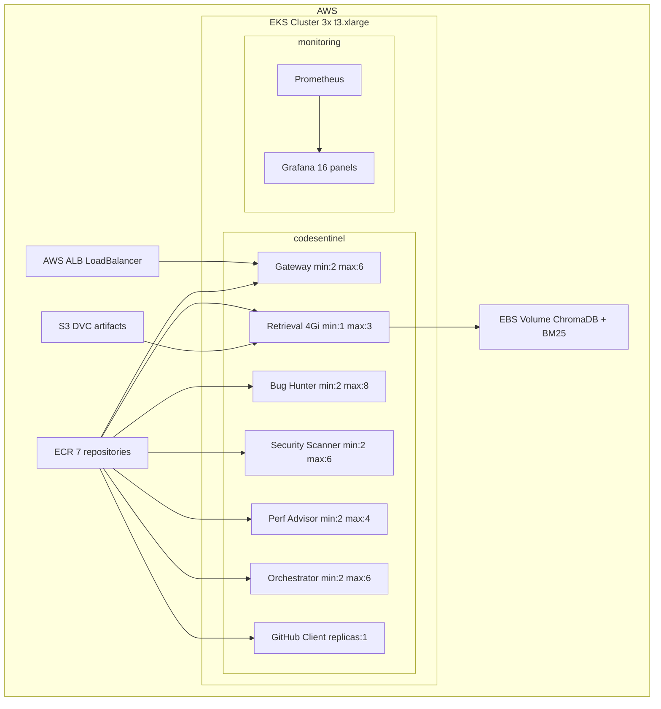

# 🔍 CodeSentinel AI

### Production-Grade Multi-Agent AI Code Review Platform


---

## 📖 Overview

**CodeSentinel AI** is a **production-grade, multi-agent GenAI platform** that automatically reviews GitHub Pull Requests — detecting security vulnerabilities, bugs, and performance issues before they reach production.

When a developer opens a PR → CodeSentinel responds in **620ms** (webhook) and posts a complete AI review within ~30 seconds — including OWASP category, CWE ID, confidence score, and fix suggestion.

---

## ❌ Problem

- Human reviewers take **2–4 hours** per PR at scale
- Static linters miss **context-dependent bugs** — null dereference, race conditions, logic errors
- Security issues (SQL injection, OWASP Top 10) slip through without semantic understanding
- No awareness of existing codebase patterns

---

## ✅ Solution

| Problem | Solution |
|---|---|
| Slow review | Automated review in ~30s |
| Missing context | RAG over 17,666 indexed functions |
| Security gaps | Semgrep OWASP + GPT-4o reasoning |
| Inconsistent quality | Structured JSON findings with confidence |
| Scale | EKS + per-service HPA |

---

## 🏗️ High-Level Architecture



---

## 🔁 End-to-End Request Flow



---

## 🧠 RAG Pipeline — 4 Stage DVC



---

## 🔍 Hybrid Search Pipeline



---

## 📊 Production Results

### SQL Injection Detected — Live Test

```
Input:
  def login(user, pwd):
      query = f"SELECT * FROM users WHERE user={user}"
      return db.execute(query)

Output:
  total_findings:  1
  critical_count:  1
  has_critical:    True
  total_cost_usd:  $0.0037
  latency_ms:      17,402ms

Finding:
  severity:     CRITICAL
  file:         src/db.py (lines 2-2)
  issue:        SQL injection via string formatting
  fix:          cursor.execute('SELECT * FROM users WHERE user = ?', (user,))
  owasp:        A03:2021 - Injection
  cwe:          CWE-89
  confidence:   95%
```

### Load Test — Locust on EKS + ALB

```
Endpoint:    POST /webhook/github
Users:       10 concurrent
Requests:    577
Failures:    0%
P95:         620ms
Average:     537ms
```

### RAG Quality — RAGAS

```
Functions indexed:    17,666
RAGAS faithfulness:   0.950   target >= 0.81
RAGAS precision:      0.920   target >= 0.76
Context recall:       0.880
Hybrid vs dense:      +21% recall
Cost per review:      $0.0037   93% under $0.06 budget
```

---

## 🖥️ Production Screenshots

### Grafana — Live Production Dashboard (EKS)
> Webhooks/sec, latency, service health, memory usag




### FastAPI Docs — Gateway on AWS ALB
> Live OpenAPI served from EKS LoadBalancer



### SQL Injection Detection — Terminal Output
> CRITICAL: OWASP A03:2021, CWE-89, 95% confidence




---

## ⚡ Infrastructure




---

## 🧰 Tech Stack

| Category | Technology |
|---|---|
| Agent Orchestration | LangGraph StateGraph |
| Embeddings | all-MiniLM-L6-v2 |
| Vector DB | ChromaDB 1.5.5 |
| Keyword Search | BM25 rank-bm25 |
| Reranking | CrossEncoder ms-marco-MiniLM |
| LLM Bugs + Security | GPT-4o |
| LLM Perf | GPT-4o-mini |
| Security Scanner | Semgrep OWASP rules |
| LLM Tracing | Langfuse |
| RAG Quality | RAGAS |
| Data Pipeline | DVC 4-stage |
| Model Registry | MLflow + DagsHub |
| Serving | FastAPI async |
| Infrastructure | AWS EKS + ALB + EBS |
| Monitoring | Prometheus + Grafana |
| Load Testing | Locust |

---


---

## 🚀 Local Setup

```bash
git clone https://github.com/akashagalave/CodeSentinel-AI
cd CodeSentinel-AI

cp .env.example .env
# Add: OPENAI_API_KEY, GITHUB_TOKEN, LANGFUSE keys

# Pull pre-built index (skip 2hr pipeline)
dvc pull

# Start all 7 services
docker-compose up

# Health check
curl http://localhost:8000/health
curl http://localhost:8002/health  # docs_count: 17666

# Load test
locust -f locustfile.py --host http://localhost:8000 \
  --users 10 --spawn-rate 2 --run-time 2m --headless
```

---

## 👨‍💻 Author

**Akash Agalave** 


